**Abstract**

This paper aims to provide a brief overview of our project. BabyVaxTrack is a website for a vaccination center that enables you to make your own profile, book appointments for you children with the time that suits you, and communicate with other clients using our social page. We aim to provide a reliable, time-saving and user-friendly platform for our clients. We learned a lot of valuable skills from this project.

**Table of Contents**

[Introduction](#page3) ……………………………………………………………………………………………………………………… 3

[Project Requirements/Feautres+GUI](#page4) ……………………………………………………………………..4

`	  `[Registration](#registration)………………………………………………………………………………………………………..4

`  `[Form Validation](#validation)…………………………………………………………………………………………………5

`  `[Sessions](#sessions)……………………………………………………………………………………………………………….7

`  `[Password Reset](#reset)………………………………………………………………………………………………..8

`  `[Roles](#roles)……………………………………………………………………………………………………………………..9

`  `[User Features](#userfeatures)…………………………………………………………………………………………………..12

`  `[Admin Features](#adminfeatures)………………………………………………………………………………………….…..22	

` `[Responsiveness](#responsiveness)………………………………………………………………………………………….…..25		

[Tools used in the project](#tools) ……………………………………………………………………………………………28

[Project Database](#database) …………………………………………………………………………………………………………..29

[Conclusion](#conclusion) ……………………………………………………………………………………………………………………….30

[References](#references) ………………………………………………………………………………………………………………………30 

**Introduction**

The idea of the project is to provide an easy way for parents to book appointments for their expected newborns to get their necessary vaccines in time or to book consultations with our crew. This idea raised from observing and finding the lack of such platforms in our country, so we took the chance and agreed to channel our energy onto this challenging journey and try out best to come up with a high quality product.

Once we came up the main idea, we started brainstorming and analyzing, we imagined how our website would look like, how it will work and what features it has. We divided the tasks fairly between the two and worked like a team, we would never achieve this project without either of us.

We learned a handful of skills throughout this project, we had to dig deep for us to find the implementation of our ideas, and we faced a lot of challenges and bugs, but thankfully we have overcome them and didn’t give up at any point. The material taken in the university course also came in very handy for us thanks to Dr. Sufyan!

Our website is reliable, secure, responsive, user-friendly, attractive and full of features, it revolutionizes the classic appointments method, since our website enables you to post your thoughts and ideas and interact with other people’s ideas.

**Requirements & Features**

- **Registration:**

- Parents have to sign up to our system by providing their full name, email, phone, password, city of residence, gender, their child’s name, child’s date of birth and the child gender.

- Once they sign up successfully, a profile is created for them and stored in our database.

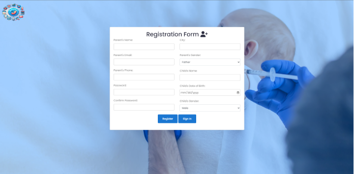

- **Form Validation:**

- 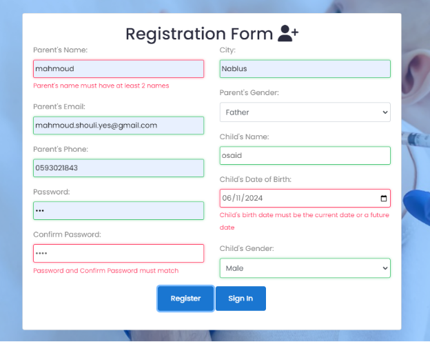When the user registers to our system, a form validation is performed, meaning there are certain criteria for some input fields, for example the full name cannot be one name only, emails and phone numbers must be unique and cannot match other user’s info, the emails and phone number must be formatted a specific way, the password and confirm password field must match, the child date must be a current date or a future date, meaning the parents must book these appointment before their child is born.

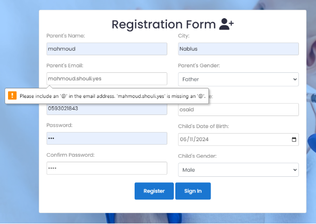

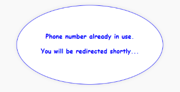

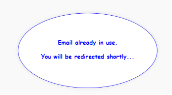

- **Sessions:**

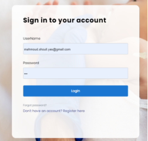

- Once the users sign in, their session start, meaning they can close the tab and come back and they will still be signed in. 
- The session ends when they sign out by pressing on the Sign Out button on the top left corner of the home page.

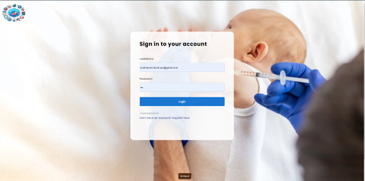

- **Password Reset:**

- In case the users forget their password, they can receive a new one using their registered email.

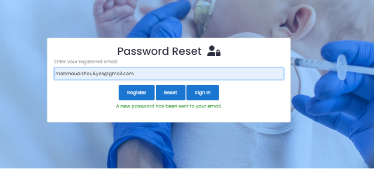

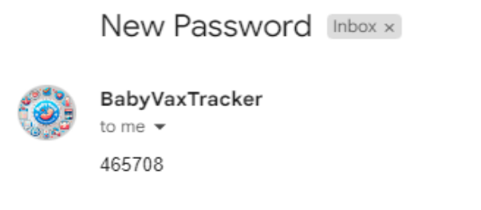

- **Roles:**

- There’s two roles: the regular parent **user**, and the **admins**.

- Let’s start with the **user** features first.

- When the user signs in, the user homepage appears.

- via the homepage the user can:

1) Go the about section to see what the center is about

1) Go to the news section to see the latest vaccine news

1) Go to ‘Booking Details’ 

1) Go to the ‘Schedules’ page and see when doctors are available

1) Go to ‘Book an Appointment’ page to book an appointment

1) ` `Go to ‘Contact Us’ to send an email to the support

1) Go to ‘Add Children’ Page to add a child

1) Go to ‘Profile’ which is the social page with feedback and reviews.

1) Subscribe to the newsletter 

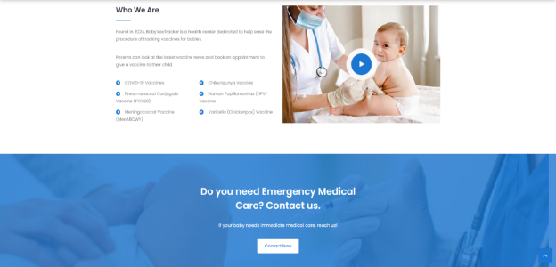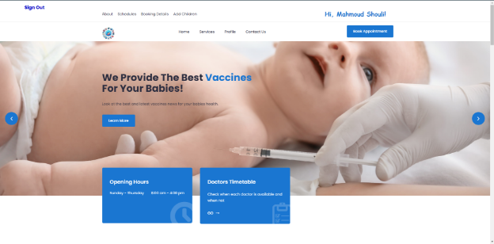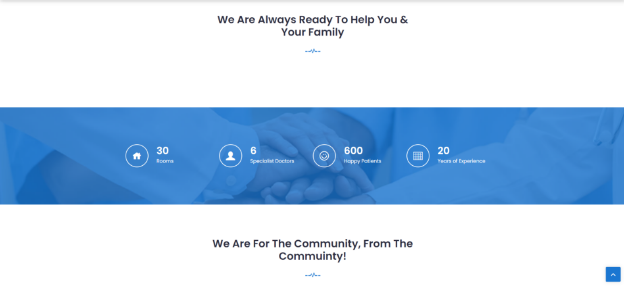

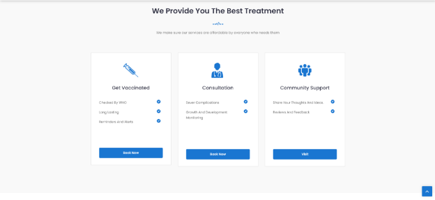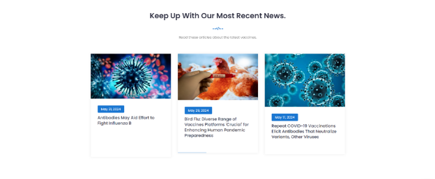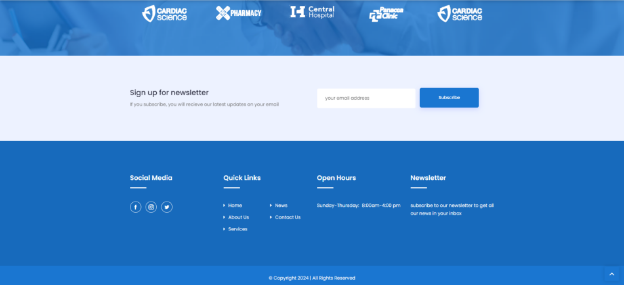

- **Schedules:**

- Users can look at the schedule table for each one of our doctors.

- When you visit the page, you will have a list of all the doctors that you can choose from and display their schedules

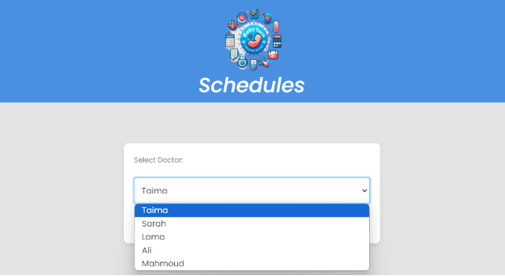

- Let’s for example choose Dr. Mahmoud

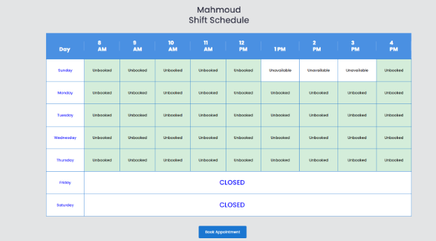

- The center is open from Sunday to Thursday from 8 am to 4 pm, meaning you can book any time you like in that duration.

- So we notice that from 1 to 3 pm Dr.Mahmoud is unavailable meaning I can’t book at these times, but the others are all unbooked mean I can book any of them.

- Let’s Book An Appointment!

- **Booking Appointments**

- You will have a list of all your child’s to choose from.
- Then a list of the doctors to choose from.
- The date which should be formatted exactly like how it’s shown in the placeholder, otherwise it will warn you.
- Appointment type which is a vaccine or a severe complication.
- Any additional info (optional).

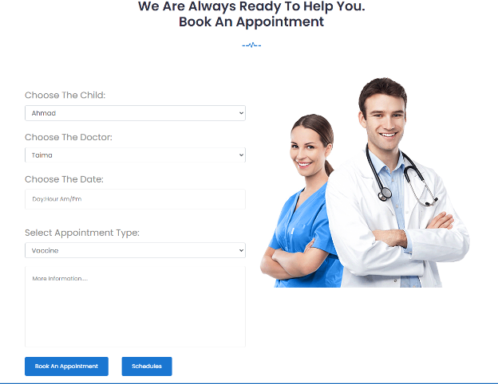

- Some things to keep in mind:

1) One child can have only one appointment.
1) You can’t book a booked or unavailable date.

- Let’s try to book for Ahmad with Dr Mahmoud on Monday 8 Am.

- If the booking was successful, the new updated schedule will look like this:

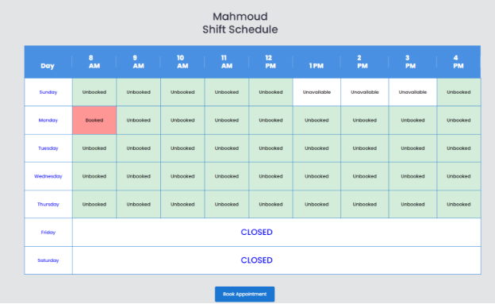

- We can clearly see that this date is now booked.

- **Booking Details:**

- You can observe your children appointments by going to the ‘Booking Details’ page from the homepage.

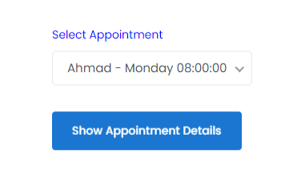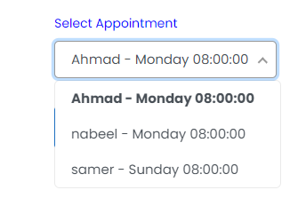

- Here this user has 3 children and has an appointment for each one of them, let’s try to look at the details for Ahmad appointment which we just booked!

  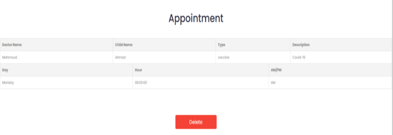

- As shown, the appointment details appeared.
- You can delete your appointment by pressing ‘Delete’.

- **Adding Children:**

- You can add a child by going to ‘Add Children’ from the homepage.

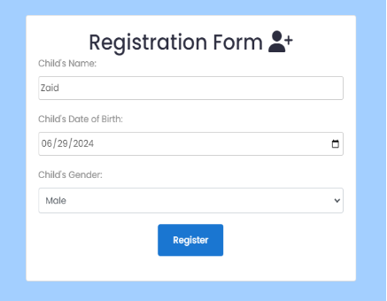

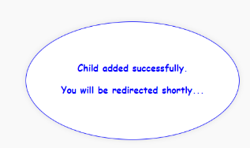

- **Profile & Social Page**

- We have a page dedicated for socializing with clients! 😊
- Click ‘Profile’ from page.

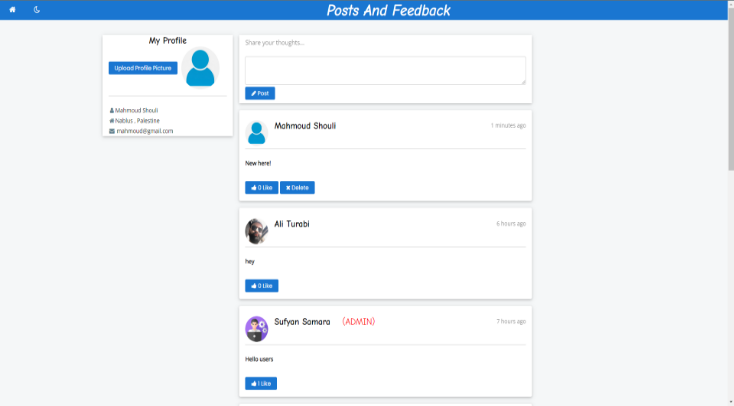

- You can upload a profile picture.
- You can post and share your ideas!
- You can see what other people posted.
- You can like and unlike their posts.
- You can delete your own post.
- You can see when the post was posted which updates every minute.
- You can change to dark theme by clicking on the moon top left corner.
- The page in dark theme.

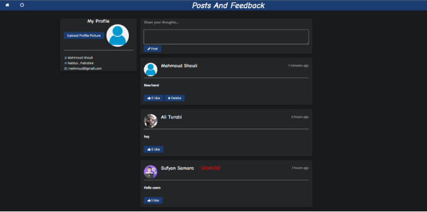

- This page is very dynamic and smooth, thanks to the help of **AJAX**!

- **Note: the system saves your theme preference (light/dark) to provide it when you come back to the page.**

- **Contact Us:**

- 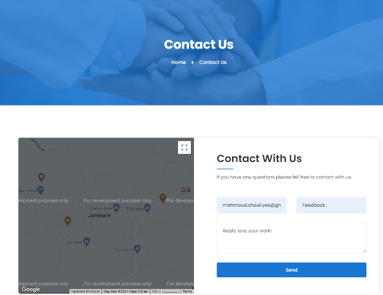You can contact the support by going to the ‘Contact Us’ page.

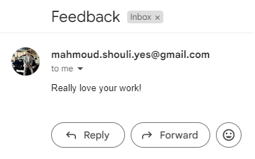

- **Newsletter**

- You can subscribe to our newsletter from the homepage, scroll all the way to the bottom and you will find this: 

- If you subscribe, you will receive some news about vaccines every day.

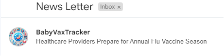

- **Admin Features**

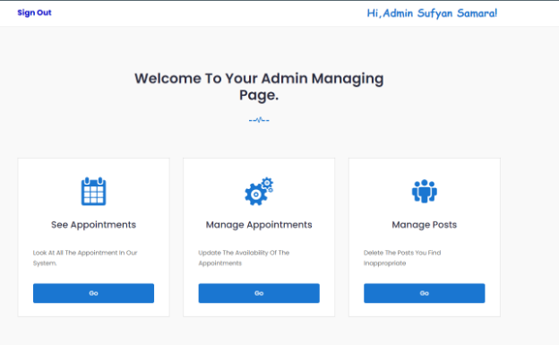

- Admins can see all appointments.

- Admins can manage all appointments by unbooking them or making a date unavailable.

- Admins can delete any post.

- **See Appointments**

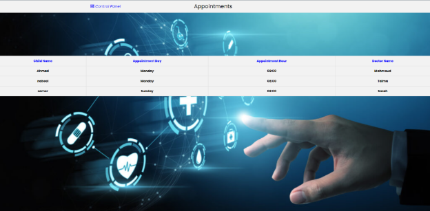

- **Manage Appointments**

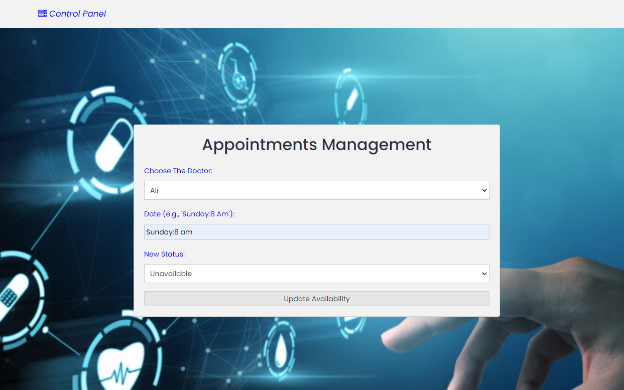

- **Manage Posts**

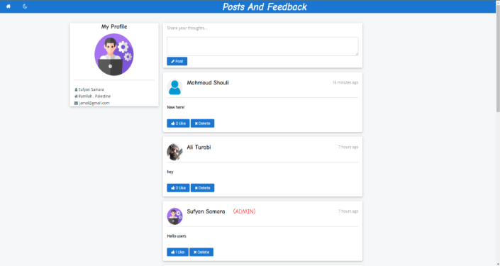

- Same features for this page with an addition that the admin has the ability to delete **any** post they want, not just their own.

**Responsiveness**

- Our page is fully responsive for all screens.

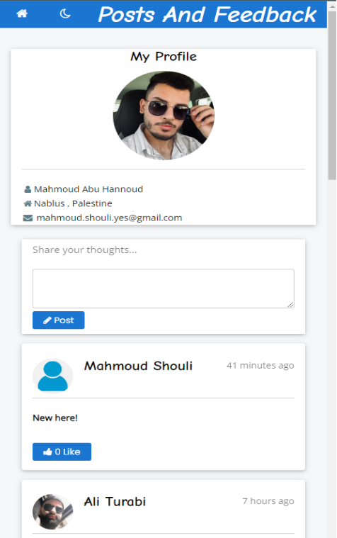

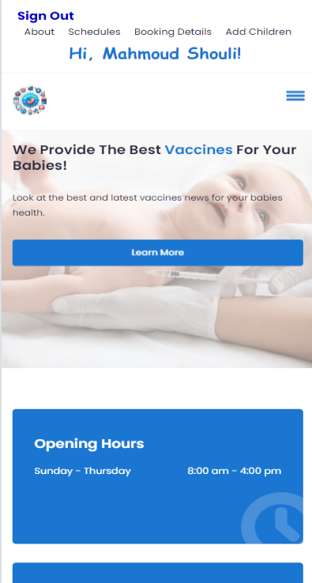

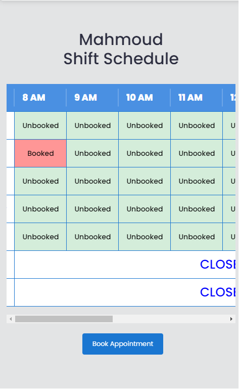

This bar shows on small screens 

**Tools**

- For IDE we used **PhpStorm** with **XAMPP** for web server.

- For FrontEnd we used **HTML, CSS, and JavaScript**.

- For BackEnd we used **PHP**.

- For Database we used **phpMyAdmin MySQL**.

- For responsiveness we used **Bootstrap**

- We used **JQuery** library, and **AJAX** requests.

- For icons we used **icofont** and **fontawesome**

- For fonts we used **google fonts.**

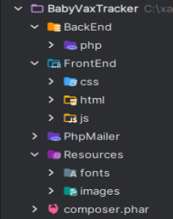

`                        `**Project Database**

- 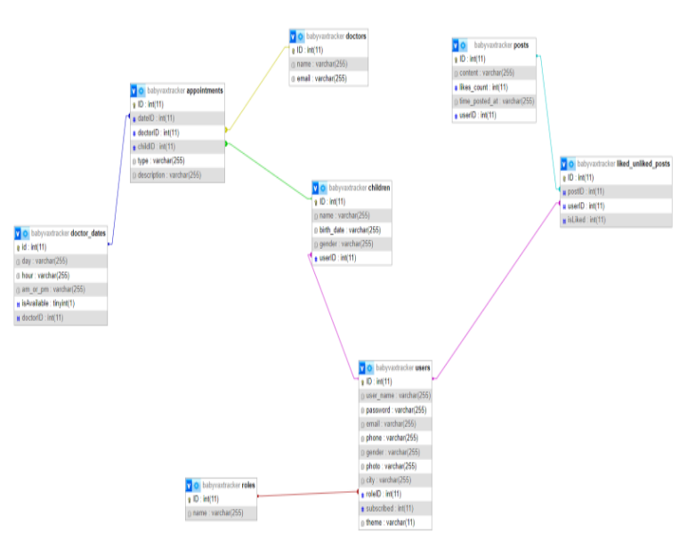We have 8 tables.

**Conclusion**

This project was a very useful experience, we learned a lot of soft and hard skills, we worked like a team and in the end we produced a special website! BabyVaxTrack will improve you and your child’s life.

**References**

<https://www.w3schools.com/>

<https://developer.mozilla.org/en-US/>

<https://fonts.google.com/>

<https://icofont.com/>

- For the data about the vaccines we got the help from our friends who are specialized in this domain.

